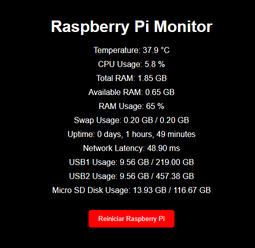

# Raspberry Pi Monitor

## Project Overview
This project is a very simple and lite web-based monitoring tool for Raspberry Pi, providing real-time information on system metrics such as CPU usage, memory usage, disk usage, temperature, uptime, and network latency. The web interface also allows the user to restart the Raspberry Pi with a simple button click.



## Features
- Real-time monitoring of CPU, RAM, and Swap usage.
- Disk usage statistics for the system and connected USB drives.
- System temperature monitoring.
- Network latency measurement.
- System uptime display.
- Simple web interface to visualize all metrics.
- Ability to restart the Raspberry Pi from the web interface.

## Dependencies
To run this project, you need to install the following dependencies:

- **Python 3**: Ensure that Python 3 is installed on your Raspberry Pi.
- **psutil**: Used for system and process utilities.
- **SimpleHTTPRequestHandler**: A module from the Python standard library for handling HTTP requests.
- **subprocess**: For executing shell commands from Python.
- **threading**: For running the HTTP server in a separate thread.
- **JQuery**: A JavaScript library used in the web interface for making AJAX calls.

## Installation
1. **Update your package list and install Python 3 (if not already installed):**
    ```sh
    sudo apt-get update
    sudo apt-get install python3
    ```

2. **Install required Python packages:**
    ```sh
    pip3 install psutil
    ```

3. **Download or clone the project repository from GitHub.**

4. **Place the `index.html` file in the example directory `/mnt/usb2/monitor/` (you can change the directory). Create the directory if it does not exist:**
    ```sh
    sudo mkdir -p /mnt/usb2/monitor/
    ```

5. **Move `index.html` to the directory:**
    ```sh
    sudo mv path_to_index.html /mnt/usb2/monitor/
    ```

## Usage
1. **Run the Python script to start the web server:**
    ```sh
    python3 path_to_script.py
    ```

2. **Access the web interface:**
    Open your web browser and navigate to `http://<your-raspberry-pi-ip>:5000`.

3. **Monitor system metrics:**
    The web interface will display real-time information about the system's CPU, memory, disk usage, temperature, and more.

4. **Restart the Raspberry Pi:**
    Click the "Reiniciar Raspberry Pi" button on the web interface to restart your Raspberry Pi.

## Contributions
Contributions are welcome! If you find any issues or have suggestions for improvements, feel free to open an issue or submit a pull request on GitHub.

## License
This project is open-source and available under the [MIT License](LICENSE).

## Acknowledgements
- This project utilizes various open-source libraries and tools.
- Special thanks to the Raspberry Pi community for their extensive documentation and support.
